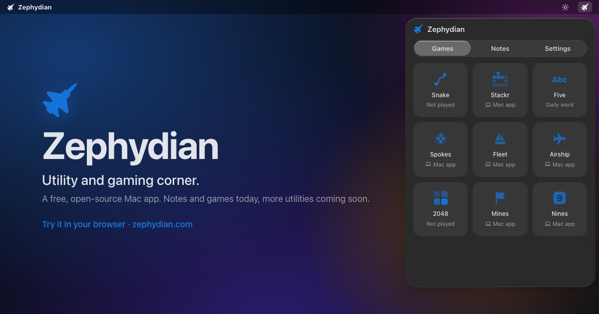

<div align="center">

# Zephydian

**Utility and gaming corner.** A free, open-source Mac app: hover over a screen corner and a panel appears with handy utilities and games. Add the utilities you want from the Library, and more utilities are coming soon.

**[zephydian.com](https://zephydian.com)**: try it right in your browser.


[](https://zephydian.com)

</div>

---

## Features

- **Corner hover to open.** Pick any of the four screen corners. The panel appears when you hover and disappears when you're done.
- **Quick Notes.** Tabbed notes that autosave as plain Markdown files you can open anywhere.
- **Utilities you choose.** Add the ones you want from the **Library**: Clipboard (a private history of what you copy), Screenshot, Markup (crop, annotate and pixelate screenshots or any image), Dictionary (definitions and synonyms from your Mac's own dictionary, offline), Passwords, Colors (pick any color on screen), Timer, Calculator, Text tools, QR Code, Awake (keep your Mac awake) and System (CPU, memory, disk, battery and network). None come preinstalled, and more utilities are coming soon.
- **Games you choose.** Snake, Stackr (block stacking) and Five (5-letter word guess) come installed. Spokes (letter-wheel crosswords), Fleet (sea battle), Airship (top-down shooter), 2048 (slide and merge numbers), Mines (clear the minefield), Nines (number-placement puzzles) and Switch (turn every light off) are a click away in the **Library**, with more games on the way. Remove any game you don't play.
- **Make it yours.** Light, dark, or system appearance, accent color themes, Liquid Glass or frosted panel (macOS 26+), and a choice of menu bar icon (or none at all).
- **Keyboard shortcuts you pick.** Record any key combination to open the panel (and for Clipboard, Screenshot and Dictionary). Zephydian tells you if something else on your Mac already uses it.
- **Featherweight.** Native Swift and SwiftUI. ~7 MB app, ~30 MB memory, and ~0.1% CPU when idle. Games pause the moment the panel hides.
- **Private.** No accounts and no tracking. Zephydian goes online only to download games and utilities you pick from the Library, and about once a day to update them (you can turn that off). Nothing about you is sent. Utilities keep their data on your Mac.

## Install

### Homebrew (recommended)

```sh
brew install ahmastan/tap/zephydian
```

After that first install, plain `zephydian` works: update with `brew upgrade zephydian`, and uninstall with `brew uninstall --zap zephydian` (`--zap` also deletes your notes and settings).

### Download

Grab the latest `.zip` (and later, a `.dmg`) from the [Releases](https://github.com/ahmastan/zephydian/releases) page and drag **Zephydian.app** into **Applications**.

### "Apple could not verify Zephydian…"

Early builds aren't signed with an Apple Developer certificate yet, so macOS blocks the first launch. To open it anyway, do **one** of these:

- Open **System Settings → Privacy & Security**, scroll down, and click **Open Anyway** next to Zephydian, **or**
- Run this in Terminal:
  ```sh
  xattr -dr com.apple.quarantine /Applications/Zephydian.app
  ```

You only need to do this once per version.

## Requirements

- macOS 14 Sonoma or later
- Apple Silicon or Intel Mac

## The Library

Open **Get more** at the end of the Games or Utilities grid to add or remove games and utilities. Built-in games install instantly. Everything else arrives as small **packs**: JavaScript programs that Zephydian runs in a locked-down sandbox and draws natively, so they look and feel like the rest of the app.

- **Safe by design.** A game can only draw on its game area, react to keys and clicks, and save its own progress. No pack has internet access.
- **You see what a utility uses.** A utility that needs more (the clipboard, screenshots, notifications, keeping the Mac awake, a keyboard shortcut) lists it under **Uses** in the Library, and Zephydian asks you before installing it. It can't use anything it didn't list. Screenshots also need macOS's own Screen Recording permission, a utility can save a file only where you choose, Markup opens only images you pick, paste or capture, and Dictionary reads what you copied only while it's on screen.
- **Background work is visible.** When a utility keeps working with the panel closed (Awake, a running timer), the menu bar icon turns your accent color, and **Settings → Packs** lets you stop it.
- **Verified.** The list of packs is signed, and every download must match its SHA-256 fingerprint before it's installed. Anything altered is refused.
- **Your choice.** Nothing is installed without you. Removing a game keeps its progress in case you come back, unless you choose to delete that too.
- **Updates** install quietly, never while you're playing. Turn off the daily check in **Settings → Packs**.

### What each utility can use

Nothing here uses the internet. Copy buttons you click work in every utility and aren't listed.

| Utility | What it can use |
| --- | --- |
| Awake | Keeps your Mac awake while it's switched on (in the background) |
| Calculator | Nothing extra |
| Clipboard | Reads what you copy while recording is on (in the background, never what password managers mark private), and its own keyboard shortcut |
| Colors | The color of a spot on your screen that you pick |
| Dictionary | The dictionary and thesaurus built into macOS, the text you copied (only while it's on screen), copying, and its own keyboard shortcut |
| Markup | Its own window, the screenshots you took, images you open or paste, copying, and saving where you choose |
| Passwords | Nothing extra |
| QR Code | Copying, and saving where you choose |
| Screenshot | Pictures of your screen (macOS asks for Screen Recording permission first), saving to Pictures/Screenshots or a folder you pick, and its own keyboard shortcut |
| System | CPU, memory, disk, battery and network figures for the whole Mac, read only while it's on screen |
| Text | Nothing extra |
| Timer | Running timers in the background, and notifications (macOS asks first) |

Want to make a game or a utility? See [docs/PACKS.md](docs/PACKS.md).

## Tip: Hot Corners

If you've assigned an action to the same corner in **System Settings → Desktop & Dock → Hot Corners**, it will clash with Zephydian. Pick a different corner in one of the two.

## Building from source

1. Install **Xcode** (16 or later) from the Mac App Store, and [XcodeGen](https://github.com/yonaskolb/XcodeGen): `brew install xcodegen`.
2. Clone this repo, then generate the Xcode project: `cd app && xcodegen`.
3. Open `app/Zephydian.xcodeproj` and press **⌘R**. Zephydian appears in the menu bar.

See [CONTRIBUTING.md](CONTRIBUTING.md) for details.

## Contributing

Bug reports, utility and game ideas, and pull requests are welcome. New games and utilities are made as packs: see [docs/PACKS.md](docs/PACKS.md). Please read [CONTRIBUTING.md](CONTRIBUTING.md) and our [Code of Conduct](CODE_OF_CONDUCT.md) first.

## License

[MIT](LICENSE) © 2026 ahmastan

Word lists are derived from [SCOWL](http://wordlist.aspell.net/) by Kevin Atkinson, and Passwords uses the [EFF Large Wordlist](https://www.eff.org/dice) (CC BY 3.0). See [THIRD_PARTY_NOTICES.md](THIRD_PARTY_NOTICES.md).

Game names in Zephydian are original. Games inspired by classic titles recreate their general mechanics only and are not affiliated with or endorsed by those titles' trademark owners.
